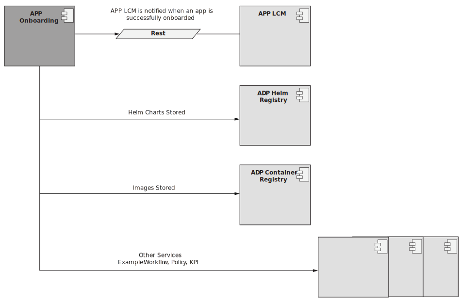

# Introduction

To run and operate radio automation applications (rApps) in EIAP, the Cloud Service Archive (CSAR) App package must be onboarded to the EIAP Automation Platform.

The App Onboarding service includes the following functions:

- Storing and onboarding artifacts in EIAP repositories
- Listing and downloading artifacts from EIAP repositories

## Understanding the EIAP App Onboarding Service

The App Onboarding service only accepts CSAR App packages.

The service uploads, decompresses and parses the package to locate metadata and artifacts for the CSAR App package. The artifacts are persisted in appropriate repositories to enable use cases for App LCM.

EIAP persists the CSAR App package contents as follows:

- **Helm Charts**: Helm chart registry based on ChartMuseum, deployed by EIAP.
- **Docker Images**: Docker registry deployed by EIAP.
- **Other artifacts**: Workflows, policies, and configurations will be stored in their respective databases.

## Execution Flow of Onboarding a CSAR App Package

The CSAR App Package goes through the following execution flow during onboarding:

1. The CSAR App package is uploaded to the App Onboarding service.
2. The CSAR is decompressed.
3. The CSAR is parsed and the App descriptor is read by the onboarding service.
4. Artifacts of the CSAR App package are distributed (such as charts and images).
5. Lastly, the status of the CSAR App package is updated to ```ONBOARDED```.

## Architecture of the App Onboarding Service

The following figure illustrates the onboarding flow for a CSAR App package when it is onboarded to EIAP’s local registries:

