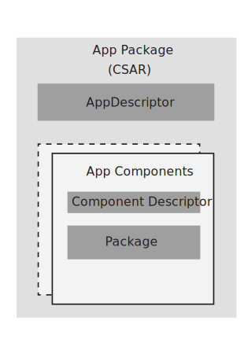

# Concepts

This section includes key concepts to understand App Onboarding service.

## App
The App implements a business logic to wholly or partly realize automated network management use cases. The App concept supports rApps.

## Artifact
Artifacts are the subparts of an App that are needed to execute it. App Docker images and Helm charts are the currently supported artifacts found in CSAR packages.

## App Package
The App Package consists of all the software artifacts that are required to realize the App functionality. The App Package constitutes an App Descriptor and App Components.

The format of the App Package is in the Cloud Service Archive (.csar) file. The TOSCA YAML CSAR file is an archive file that uses the ZIP file format whose structure complies with the TOSCA
Simple Profile YAML v1.1 Specification.



## App Package Structure

A decompressed CSAR has the following three main directories:

1. [Definitions](#concepts?chapter=definitions)
2. [OtherDefinitions](#concepts?chapter=other-definitions)
3. [Metadata](#concepts?chapter=metadata)

### Definitions
The `Definitions` directory contains the `AppDescriptor.yaml` file.

The Yaml file defines the contents of an App and details of interaction with the Platform services.

#### AppDescriptor.yaml
An example of an `AppDescriptor.yaml`, which contains the three main elements, is shown in the following:
   ```
Description of an APP:
     APPName: eric-oss-5gcnr
     APPVersion: 1.0.173-1
     APPType: rApp
APPComponent:
     NameofComponent: eric-oss-5gcnr
     Version: 1.0.173-1
     Path: OtherDefinitions/ASD/eric-oss-5gcnrASD.yaml
     ArtefactType: Microservice
AppPermissions:
    - Resource: kafka
      Scope: foo
   ```

| Element                        | Qualifier     | Description |
| ----------------------------- | -------------- | ------------|
| Description of an App  | Mandatory | Details of an App like name and version |
| App Component          | Mandatory | Defines the details of an App Component, each component is identified individually|
| App Permissions        | Optional  | Defines the Permissions which an App requires |

##### Description of an App

| Element               | Qualifier    | Description  |
| ---------------------- | -------------- | ------------ |
| APPName            | Mandatory | Name of App |
| APPVersion         | Mandatory | Version of App |
| APPType            | Mandatory | rApp |

##### App Component
Defines the abstract view of the component that constitutes an App, it can be either a microservice or an artifact in itself.

Each component will be identified individually.

| Element                               | Qualifier    | Description                                                                                                                                                 |
| ---------------------------------- | -------------- | ---------------------------------------------------------------------------------------------------------------------------- |
| Name of the Component | Mandatory | Name of the Artifact                                                                                                                                   |
| Path                                      | Mandatory | Software path of the Artifacts in the CSAR package                                                                           |
| Version                                | Mandatory | Version of the App Component                                                                                                               |
| Artefact Type                       | Mandatory | The type of Artifact                                                                                                                                      |

##### App Permissions
Defines the Permissions which an App requires. This is an optional element. More than one permission is possible. It is a list of key value pairs.

| Element       | Qualifier    | Description          |
|---------------| -------------- |----------------------|
| Resource      | Mandatory | Name of the Resource |
| Scope         | Mandatory | Required Scope       |

### Other Definitions
The `Other Definitions` directory currently contains only the `ASD` (Application Service Descriptor) directory.

#### Application Service Descriptor
Within ASD directory there is a Helm chart TAR file, an `ASD.yaml` file and an `Images` folder.

##### ASD.yaml

The `ASD.yaml` file contains the following elements presented on the following table.

| Element                               | Qualifier    | Description                                                                                                                                                                                                                                                    |
| ---------------------------------- | -------------- | ------------------------------------------------------------------------------------------------------------------------------------------------------------------------------------------------------ |
| asdId                                    | Mandatory | Identifier of this ASD information element. This attribute must be globally unique. The format is defined in the data model specification phase  |
| asdSchemaVersion          | Mandatory | Specifies the version of the ASD schema                                                                                                                                                                                               |
| asdProvider                        | Mandatory | Provider of the AS and of the ASD                                                                                                                                                                                                             |
| asdApplicationName        | Mandatory | Name to identify the Application Service. Invariant for the AS lifetime                                                                                                                                               |
| asdApplicationVersion     | Mandatory | Specifies the version of the Application                                                                                                                                                                                                   |
| asdApplicationInfoName | Optional     | Human readable name for the Application service. Can change during the AS lifetime                                                                                                              |
| asdInfoDescription            | Optional    | Human readable description of the AS. Can change during the AS lifetime                                                                                                                                   |
| deploymentItems               | Mandatory | Reference to the path for the artifacts included in the App                                                                                                                                                                                                                                 |

##### Deployment Items
The `deploymentItems` element within the `ASD.yaml` file contains the elements expressed in the table below.

| Element                   | Qualifier    | Description                                               |
| ------------------------  | -------------- | -------------------------------------------------- |
| deploymentItemId | Mandatory | The identifier of this deployment item |
| artifactId                  | Mandatory | Reference to a DeploymentArtifact       |

##### Images
The `Images` directory contains a TAR file of all images required for the App.

### Metadata
The `Metadata` directory contains the `Tosca.meta` metadata file.

The `Tosca.meta` file is the entry point of the App package. It provides information for processing the CSAR file,
and it contains a reference to the `AppDescriptor.yaml` and `ASD.yaml`. Entry-Licenses and Entry-Security are not yet supported.

| Element                                | Qualifier     | Description                                                                     |
| ----------------------------------- | -------------- | ------------------------------------------------------------------- |
| TOSCA-Meta-File-Version | Mandatory | The attribute that holds TOSCA-Meta-File-Version |
| CSAR-Version                     | Mandatory | The attribute that holds CSAR-version                      |
| Created-By                           | Mandatory | The user that created the App Package                 |
| Entry-Definitions                 | Mandatory | Reference to App descriptor yaml                               |
| Entry-OtherDefinitions        | Mandatory | Reference to the other definitions                              |
