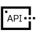

# App Onboarding Overview

App Onboarding is a service that onboards rApp CSAR packages for EIAP App Manager. An rApp CSAR package is uploaded, parsed and the constituent artifacts are distributed to their respective EIAP Platform services.

---

# Explore this service

<e-eui-docs-columns columns=" 1fr 1fr 1fr">

<table><tr><td width="70px">

</td><td>

# Getting Started
</td></tr></table>
Learn and understand the key concepts of this service.

- [About This Service](#about-the-service)
- [Concepts](#concepts)

<table><tr><td width="70px">

</td><td>

# Developer Documentation
</td></tr></table>
Get some samples walkthroughs and developer guides related to this service.

- [Use Cases](#developer-guide-use-cases)
- [Create CSAR App Package](#developer-guide-create-csar)

<table><tr><td width="70px">

</td><td>

# API References
</td></tr></table>
List of APIs this service provides.

- [API Guide](#api-guide)

</e-eui-docs-columns>

---
