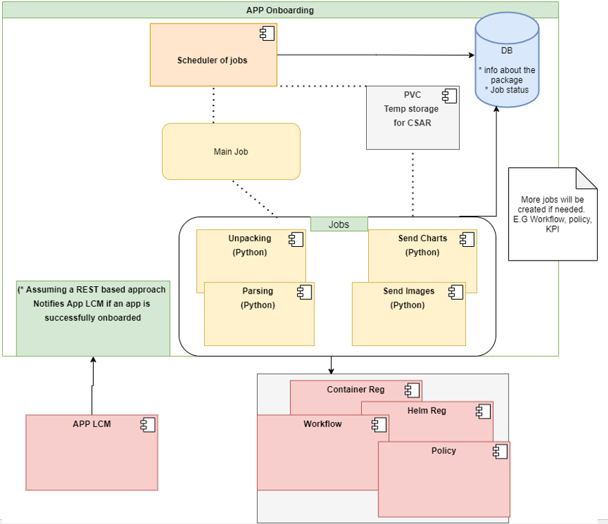
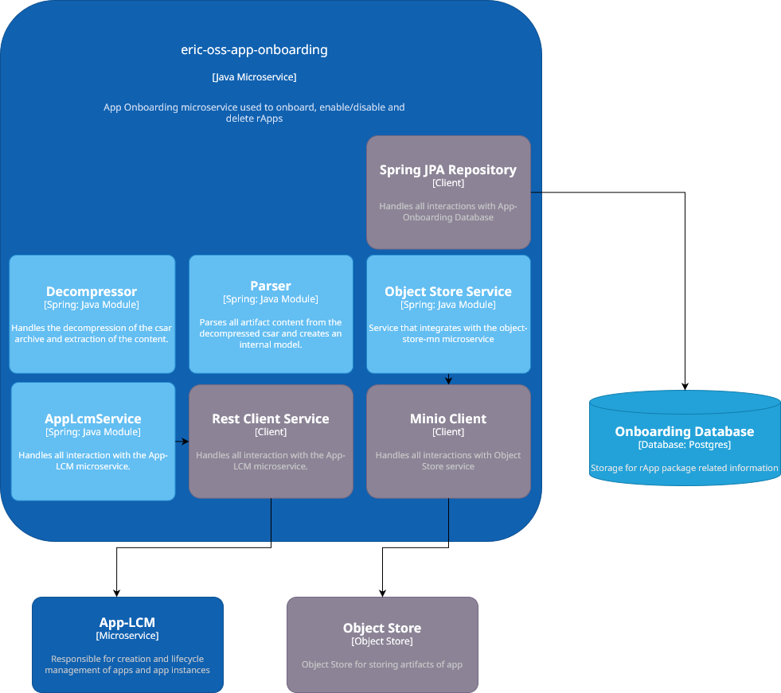

<!--Document Template information:
Prepared:CNAM USEr
Approved:***
Document Name:LCM user guide
Revision: {!../../.bob/var.version!}
Date: $(date -u +'%Y-%m-%dT%H:%M:%SZ')
-->

# App Onboarding User Guide

[TOC]

## Overview

To run and operate radio applications (rApps) in EIC, the Cloud Service Archive (CSAR) App Package must be onboarded to the EIC SDK Platform.

App Onboarding V1 API is planned for deprecation. App Onboarding V2 API has been introduced.

## Understanding the App Onboarding Service

An App implements business logic to (partly or completely) realize automated network management use cases. Such Apps are intended to be small,
both in terms of functionality (realizing relatively small, well-defined use cases) and in terms of software (delegating as much behavior as possible to the platform).
The job of App Onboarding is to perform the onboarding of Apps so that their Life Cycle can be managed by App Life Cycle Management (App LCM). The App Onboarding
service only accepts CSAR App packages. It uploads and parses the package to locate information on artifacts for the CSAR App package. The files
are persisted in appropriate repositories to enable use cases for App LCM.

App Onboarding currently persists the following artifact types from a CSAR App package:

- Helm Charts: Application Development Platform (ADP) Helm chart registry based on ChartMuseum, deployed by EIC.
- Docker Images: ADP Docker registry deployed by EIC.

## Execution Flow of Onboarding a CSAR App Package

### Execution Flow for V1

The CSAR App Package goes through the following execution flow during onboarding:

1. The CSAR App package is ``UPLOADED`` to the App Onboarding service.
2. The CSAR App package is decompressed and any App descriptor files or artifacts present are ``UNPACKED``.
3. The App descriptor files within the CSAR App package are ``PARSED`` for metadata pertaining to the App.
4. Artifacts (such as Helm charts and Docker images) of the CSAR App package are distributed to repositories and the status of the CSAR App package is updated to ``ONBOARDED``.

Note: Any deviation from the above flow will result in a ``FAILED`` status.

### Execution Flow for V2

The CSAR App Package goes through the following execution flow during onboarding:

1. The CSAR App package is ``UPLOADED`` to the App Onboarding service.
2. The CSAR App package is decompressed and any App descriptor files or artifacts present are ``UNPACKED``.
3. The App descriptor files within the CSAR App package are ``PARSED`` for metadata pertaining to the App.
4. Artifacts are uploaded to Object Store. A request is sent to App LCM to create an App. The status of the CSAR App package is updated to ``ONBOARDED``.

Note: Any deviation from the above flow will result in a ``FAILED`` status. In the case of a failure after any artifact has been pushed to Object Store,
an attempt to clean up the bucket in Object Store will take place. Should this fail, the status will be set to `ROLLBACK_FAILED`.

### Architecture

#### Interfaces

Type of interface | Description
---|---
Onboarding Service | Interface to fetch workload artifacts
HCR (Helm Chart Registry) *| Interface to store and fetch Helm charts
CR (Container Registry) *| Interface to store helmfiles and to check container images are present
CCR (Centralized Configuration Repository) | Interface to interact with configuration repository to check for/fetch/store Day zero configuration (Day 1 configuration will not be fetched by this service)
Idam | Interface to check authenticity of received LCM operation requests
K8S Manager | Interface to add/delete/modify K8S clusters
Data Persistence Service (Postgres) | The data interface allows to store workload inventory data, workload operations data, K8S access data and other persistent data
Logging | Interface
K8S | Interface to interact with k8S API Server to App Onboarding workloads

`*` These Interfaces apply only to App Onboarding V1.

### Deployment View

The App Onboarding is packaged as a Docker container.

It supports deployment on Kubernetes.

It is dependent on PostgreSQL that is installed as a database backend.

The App Onboarding Service is stored in one container in a pod.



Figure 1 Deployment view of App Onboarding V1



Figure 2 Deployment view of App Onboarding V2

To deploy the Service, refer to the [Deployment section](#deployment), which:

- Explains how to get started using the App Onboarding Service in the supported environments.
- Specifies configuration options for starting the App Onboarding docker container.

If problems occur when using the service, refer to the [Troubleshooting section](#troubleshooting).

### Dimensioning and Characteristics

#### Dimensioning

The service provides by default resource request values and resource limit values as part of the Helm chart.

These values correspond to a default size for deployment of an instance.

This chapter gives guidance in how to do service dimensioning and how to change the default values when needed.

#### Consider Dimensioning Aspects

Consider the basic dimensioning attributes listed in the Configuration Parameters section and decide on a target initial API transaction capacity on the utilized interfaces.

The below provided figures are approximate and for guidance only. Figures were produced using a reference system.

The values below reflect modelled traffic, i.e. when only a single interface is utilized.

Based on the above values, derive the resource requirements for Kubernetes.

The values below are defined in Kubernetes resource units.

| Image name              | Initial number of instances | Local storage per instance | Resource request memory | Resource request CPU | Resource limit memory | Resource limit CPU |
|-------------------------|-----------------------------|----------------------------|-------------------------|----------------------|-----------------------|--------------------|
| eric-oss-app-onboarding | 2                           | 15Gi                       | 1.2Gi                   | 1000m                | 1.5Gi                 | 1250m              |

#### Override Default Dimensioning Configuration

If other values than the default resource request and default resource limit values are preferred, they must be overridden at deployment time.

Here is an example of the Helm install command where resource requests and resource limits are set for a minimum configuration

```bash
helm install app-onboarding charts/eric-oss-app-onboarding --set global.security.tls.enabled=false -n <namespace> \
--set resources.requests.cpu=125m \
--set resources.requests.memory=384Mi \
--set resources.limits.cpu=100m \
--set resources.limits.memory=2Gi
```

Image name | Resource request memory | Resource request CPU | Resource limit memory | Resource limit CPU
---|---|---|---|---
eric-oss-app-onboarding | 256Mi | 125m | 2Gi | 100m

To use minimum configuration, override the default values for resource requests and resource limits in the Helm chart at deployment time.

#### Use Maximum (Default) Configuration per Service Instance

The maximum recommended configuration per instance is provided as default in the Helm chart.

Both Resource Request values and Resource Limit values are included in the Helm charts.

#### Upgrade - In Service Software Upgrade

The App Onboarding supports upgrade without loss of persistent service configuration data, and notifications.

## Deployment

This section describes the operational procedures for how to deploy and upgrade the App Onboarding Service in a Kubernetes environment with Helm.

It also covers hardening guidelines to consider when deploying this service.

### Prerequisites

- A running Kubernetes environment
- Some knowledge of the Kubernetes environment, including the networking details
- Access rights to deploy and manage workloads
- Availability of the kubectl CLI tool with correct authentication details. Contact the Kubernetes System Admin if needed
- Availability of the Helm package
- Availability of Helm charts and Docker images for the service and all dependent services
- Create RoleBinding on the cluster level with cluster admin permissions
- Document Database PG Service

### Deployment in a Kubernetes Environment Using Helm

This section describes how to deploy the service in Kubernetes using Helm and the kubectl CLI client.

Helm is a package manager for Kubernetes that streamlines the installation and management of Kubernetes applications.

### Preparation

Prepare Helm chart and Docker images.

Helm chart in the following link can be used for installation: ```https://arm.seli.gic.ericsson.se/artifactory/proj-eric-oss-ci-internal-helm-local/eric-oss-app-onboarding/```

### ClusterRoleBinding creation

```kubectl create clusterrolebinding <NAMESPACE> --clusterrole=cluster-admin --serviceaccount=<NAMESPACE>:<CHART_NAME>```

### Helm Chart Installation of Helm and Container Registry

This step is only required for App Onboarding V1.

**Note**: To create the secret for container registry, create a HTTP password file by using the command htpasswd -cBb htpasswd username password, then use the command kubectl create secret generic <USERS_SECRET_NAME> --from-file=htpasswd=./htpasswd -n `<NAMESPACE>` to generate it.

```helm repo add chart-repo https://arm.rnd.ki.sw.ericsson.se/artifactory/proj-adp-gs-all-helm/   & helm search repo chart-repo/eric-lcm-helm-chart-registry```

```helm install newchart chart-repo/eric-lcm-helm-chart-registry -n helmreg --set global.security.tls.enabled=false```

```helm install contregnew chart-repo/eric-lcm-container-registry --set global.security.tls.enabled=false -n contreg --set registry.users.secret=usersecret --set ingress.enabled=false --set ingress.hostname="eric-lcm-container-registry-registry.contreg.svc.cluster.local" --set ingress.tls.enabled=false```

### Create secrets for db and Helm registry in that namespace

This step is only required for App Onboarding V1.

```kubectl create secret generic eric-oss-app-mgr-container-registry-secret --from-literal=password=admin --from-literal=user=admin --namespace namespace note: if you are deploying the container registry use the same values you have used here e.g admin admin```

```kubectl create secret docker-registry k8s-registry-secret --docker-server=armdocker.rnd.ericsson.se --docker-username=user --docker-password=password --namespace  note: Use  your own credentials here```

```kubectl create secret generic eric-appmgr-data-document-db-credentials --from-literal=custom-user=apponboardinguser
--from-literal=custom-pwd=postgres --from-literal=super-user=postgres --from-literal=super-pwd=postgres --from-literal=metrics-user=apponboardingmetricsuser
--from-literal=metrics-pwd=postgres --from-literal=replica-user=apponboardingreplicauser --from-literal=replica-pwd=postgres --namespace namespace```

### Helm Chart Installation of App Onboarding Service

NOTE: Ensure all dependent services are deployed and healthy before you continue with this step (see previous chapter).

Users can override the default values provided in the values.yaml template of the Helm chart.

#### Deploy the App Onaboarding Service

##### App Onboarding Service Deployment

```helm install <RELEASE_NAME> <CHART_REFERENCE> --namespace <NAMESPACE>```

##### Verify the Availability of the App Onboarding Service

In order to check a successful deployment of the App onboarding Service, the following steps can be performed

- Check if the chart is installed with the provided release name and in the related namespace using ```helm ls``` command

```helm ls```

Output:

```bash
NAME                        NAMESPACE                   REVISION    UPDATED     STATUS      CHART                               APP VERSION
eric-oss-app-onboarding      demo-deployment-namespace   1           2022-01-01 01:01:01.8697656 +0100 CET    deployed    eric-oss-app-onboarding-1.0.21-1      0.1.0
```

Chart status should be reported as DEPLOYED.

- Verify the status of the Helm chart deployed, by getting the status for your chart installed

```bash
helm status eric-oss-app-onboarding -n <NAMESPACE>
```

Example output:

```bash
LAST DEPLOYED: Fri Jan 01 01:01:01 2022
NAMESPACE: demo-deployment-namespace
STATUS: DEPLOYED
```

Chart status should be reported as DEPLOYED.

```bash
kubectl get deployment -n <NAMESPACE>
```

## Hardening

The service is by default pre-hardened. No additional hardening is required. The following pre-hardening actions have been made:

1. The service is built on a minimalistic container image with small footprint. Only the required libraries are included.
2. The service utilizes a container optimized operating system (Common Base OS) and latest security patches are applied.
3. The container goes through vulnerability scanning.
4. The service is configured to the strict minimum of services and ports to minimize the attack surface.

## Upgrade Procedure

The App Onboarding Service supports upgrade without loss of persistent service configuration data.

In Kubernetes the Helm chart upgrade can be done to migrate the App Onboarding Service from the existing to a
higher version.

- Check if App Onboarding Service is installed in the system with a specific chart version.

```bash
helm ls
```

This should show that App Onboarding Service is installed having a release name and a specific chart revision and the chart status should be reported as DEPLOYED.

- Check service type for the current App Onboarding Service deployment

```bash
kubectl -n <NAMESPACE> describe service <SERVICE_NAME>
```

Should print out the service details. Check the Type entry.

```<NAMESPACE>```: String value, the namespace where App Onboarding Service is installed.
```<SERVICE_NAME>```: The service name used during installation, typically eric-oss-app-onboarding.

- Migrate to a higher version using Helm upgrade procedure

```helm upgrade <RELEASE_NAME> <CHART_REFERENCE>```

- Should give the output Release <RELEASE_NAME> has been upgraded.
- <RELEASE_NAME>: String value, a name to identify and manage your Helm chart.
- <CHART_REFERENCE>: A path to a packaged chart, a path to an unpacked chart directory or a URL to upgrade to.

```helm upgrade eric-oss-app-onboarding https://arm.seli.gic.ericsson.se/artifactory/proj-eric-oss-ci-internal-helm-local/eric-oss-app-onboarding/eric-oss-app-onboarding-1.0.21-1.tgz```

## Operation and Maintenance

### Backup and Restore

App Onboarding does not support backup and restore itself.

For backup and restore data App Onboarding saved in Document Database PG Service use next instructions:

- Backup and Restore for database: [Backup and Restore](https://adp.ericsson.se/marketplace/document-database-pg/documentation/6.3.0/dpi/service-user-guide#backup-and-restore)

## Troubleshooting

Prerequisites for Troubleshooting:

- ```kubectl``` CLI tool properly configured
- ```helm``` CLI tool properly configured
- ```App Manager``` installed

**NOTE:**
Do not try to uninstall App Onboarding without checking for ongoing jobs in the namespace. Doing so would lead to the pod stock in terminating state.

### Request to Onboard an App fails

#### Onboard Request Issue

A request to onboard an App has failed. The following error appears in the logs of eric-oss-app-onboarding pod:
``ConnectionResetError(104, 'Connection reset by peer')``.

#### Onboard Request Cause

This error arises from the interruption of the communication connection between the client and the server.
Often occurs when parallel POST calls with large CSAR files are made on a system under substantial load.

#### Onboard Request Solution

1. Run the following command to edit the App Onboarding VirtualService in the cluster namespace:
``kubectl edit virtualservice app-onboarding-virtual-service -n <namespace>``
2. Locate the section in the YAML configuration that specifies the time-out settings for the POST requests and then
increase the time-out value to a higher value. The following are the possible values: 1s, 1m, 1m30s.
3. Save the modifications and exit the editor. Kubernetes automatically applies the changes to the VirtualService.

Example:

```yaml
http:
    - match:
        - method:
            exact: POST
      name: onboarding-post-request
      retries:
        attempts: 3
      route:
        - destination:
            host: eric-oss-app-onboarding
            port:
                number: 8080
                timeout: 1m
```

### Onboard App fails due to Python Job timeout

#### Python Job timeout Issue

An App onboarding fails due to the onboarding Python Job reaching the timeout. An error event will be visible for the
App similar to ``job-push-image-xxx is not complete after 480.0 retries``.

Note: The Job name can change in the above error event based on the python job that has timed out.

#### Python Job timeout Cause

The onboarding Python Job timeout can happen when the CSAR being uploaded is of a large size (> 500Mb).

#### Python Job timeout Solution

1. Run the following command to edit the eric-oss-app-onboarding statefulset ``kubectl edit statefulset eric-oss-app-onboarding -n <namespace>``
2. Locate the section in the YAML configuration that specifies the Python Job related settings under the eric-oss-app-onboarding container and
then increase the ``PYTHON_JOB_POLLING_TIME`` & ``ACTIVE_DEADLINE_SECONDS`` value to a higher value (increase by 20%). Repeat increasing the
value until the App is onboarded. Example of default values in eric-oss-app-onboarding statefulset yaml is provided below.
3. Save the changes and wait for the app-onboarding pods to be recreated with the new configuration.

```yaml
apiVersion: apps/v1
kind: StatefulSet
spec:
  template:
    spec:
      containers:
        - name: eric-oss-app-onboarding
          env:
            - name: ACTIVE_DEADLINE_SECONDS
              value: 3900
            - name: PYTHON_JOB_POLLING_TIME
              value: 3600
```

| Name                    | Type    | Description                                                                                                                                                                 | Default Time | Action                                     |
|-------------------------|---------|-----------------------------------------------------------------------------------------------------------------------------------------------------------------------------|--------------|--------------------------------------------|
| PYTHON_JOB_POLLING_TIME | Integer | Specifies the duration in seconds for polling the Job status to assess whether it is completed.                                                                             | 3600         | Increase by 20% for each 150Mb over 500Mb  |
| ACTIVE_DEADLINE_SECONDS | Integer | Specifies the duration in seconds relative to the startTime that the Job is continuously active before the system tries to terminate it. Value must be a positive integer.  | 3900         | Increase by 20% for each 150Mb over 500Mb  |

### Onboard App fails

#### Onboard App Issue

Onboard App failed.

#### Onboard App Cause

Cluster capacity is full. When the cluster is full, the job that is onboarding the App can hang as there is not enough capacity to onboard the App.

#### Onboard App Solution

1. Debug app-mgr.
2. Clean up cluster resources and increase available capacity.
3. If you have identified the issue, then cleanup App data and onboard the App again. For further details,
see the sections Onboard an rApp through the Northbound Interface and Delete an Onboarded rApp through the Northbound
Interface in the Application Manager User Guide , 1553-CRX 901 363. The command line is as follows: delete/v1/apps/{appId} and post/v1/apps

### App Package Fails CSAR Parsing Stage

#### Parsing Stage Fails Issue

If an issue occurs while processing the CSAR, the App package status updates to a FAILED status.
When trying to upload the same package again, it could fail at the parsing stage of the CSAR because the previously FAILED App package was not deleted from App-Manager.

#### Parsing Stage Fails Cause

This parsing error arises when there is already an App package in App-Manager that has a FAILED app status.
This error blocks the onboarding of the App package in subsequent onboarding attempts.

#### Parsing Stage Fails Solution

1. Run the following command line to list all apps in App-Manager: get /v1/apps/
2. Retrieve the ID of the App in a FAILED state. The ID must match the APPName and APPVersion as defined in the AppDescriptor.yaml file inside the CSAR.
For further details, see the section Check an Onboarded App through the Northbound Interface in the Application Manager User Guide , 1553-CRX 901 363.
3. Run the following command to delete the FAILED app: delete/v1/apps/{appId}. To cleanup app data and onboard the app again,
see the sections Delete an Onboarded rApp through the Northbound Interface and Onboard an rApp through the Northbound Interface in the Application Manager User Guide , 1553-CRX 901 363.

### Cleanup rApp Packages stuck in Uploaded State

#### rApp Packages State stuck Issue

The rApp packages are stuck in an UPLOADED state.

#### rApp Packages State stuck Cause

The premature interruption of the onboarding Kubernetes jobs.

#### rApp Packages State stuck Solution

An automatic cleanup for this issue is run every 24 hours. See the following table for details on how to configure the values file.

| Name           | Type   | Description                                                                                                                                                   | Default Time |
|----------------|--------|---------------------------------------------------------------------------------------------------------------------------------------------------------------|--------------|
| cron.fetchRate | String | Specifies the waiting period in milliseconds between each triggering of the automatic cleanup. Value must be a positive number surrounded by quotation marks. | "86400000"   |
